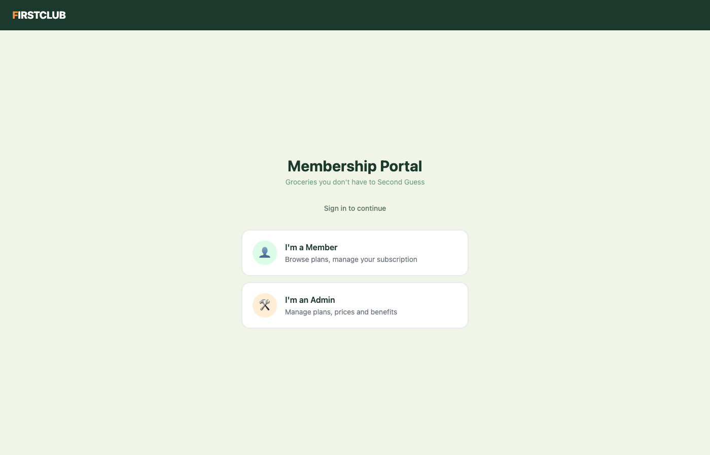
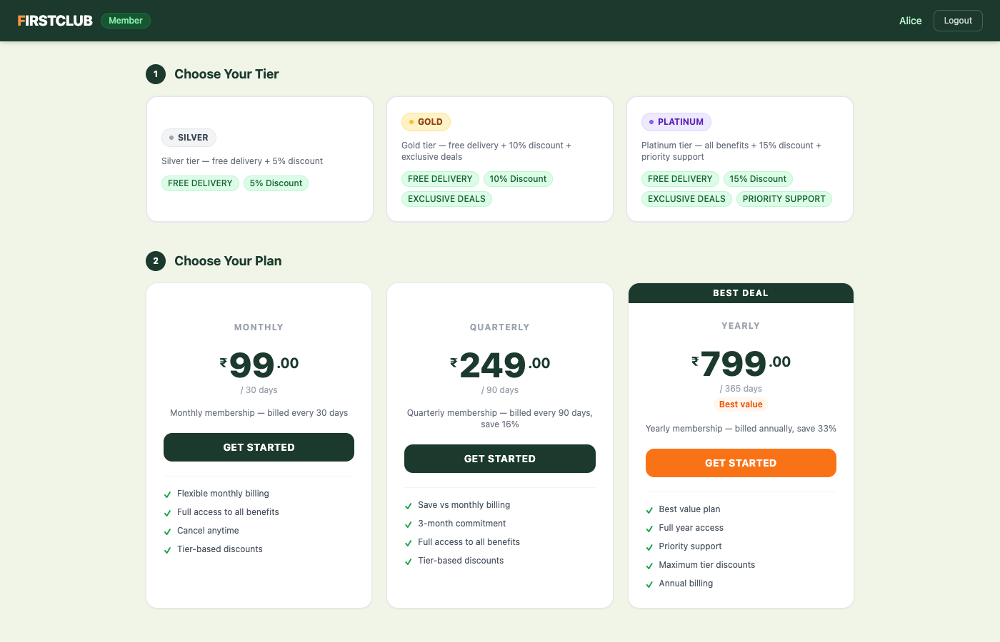
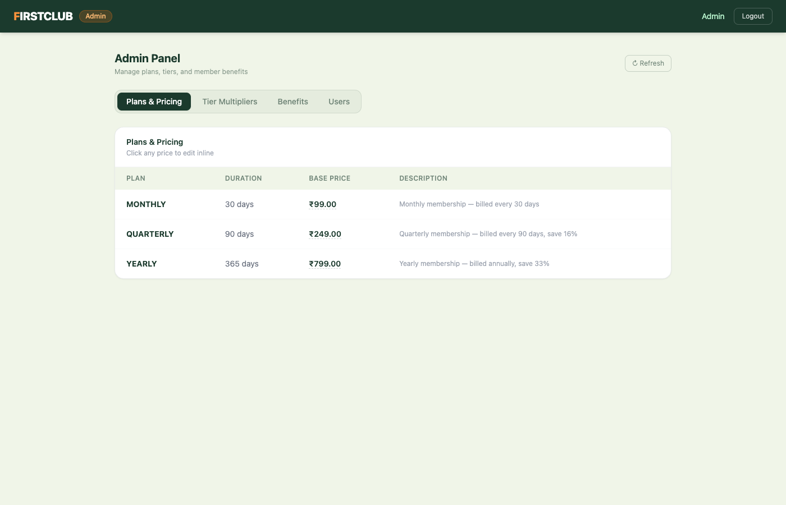
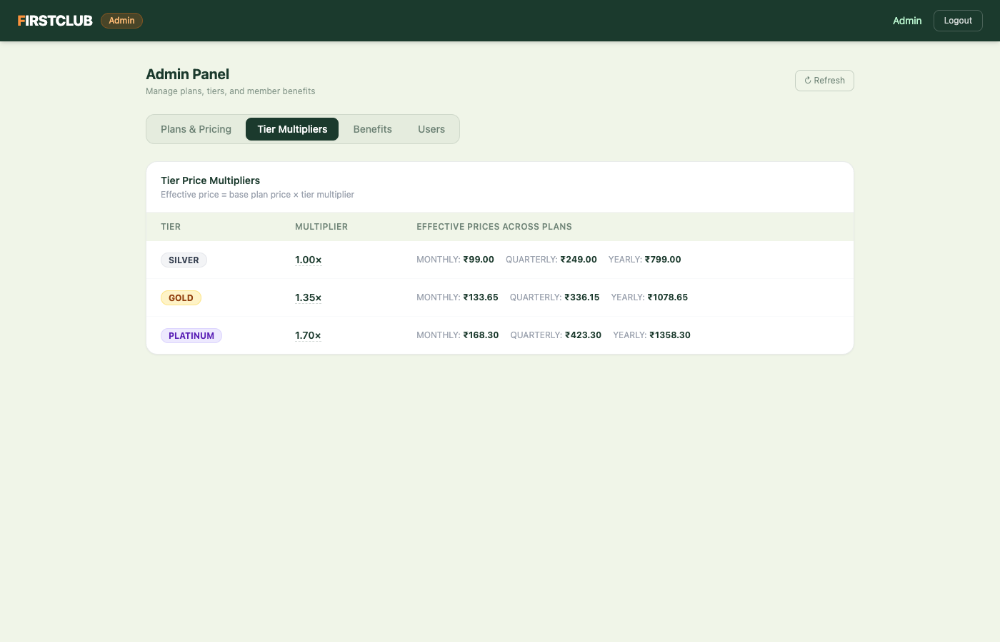
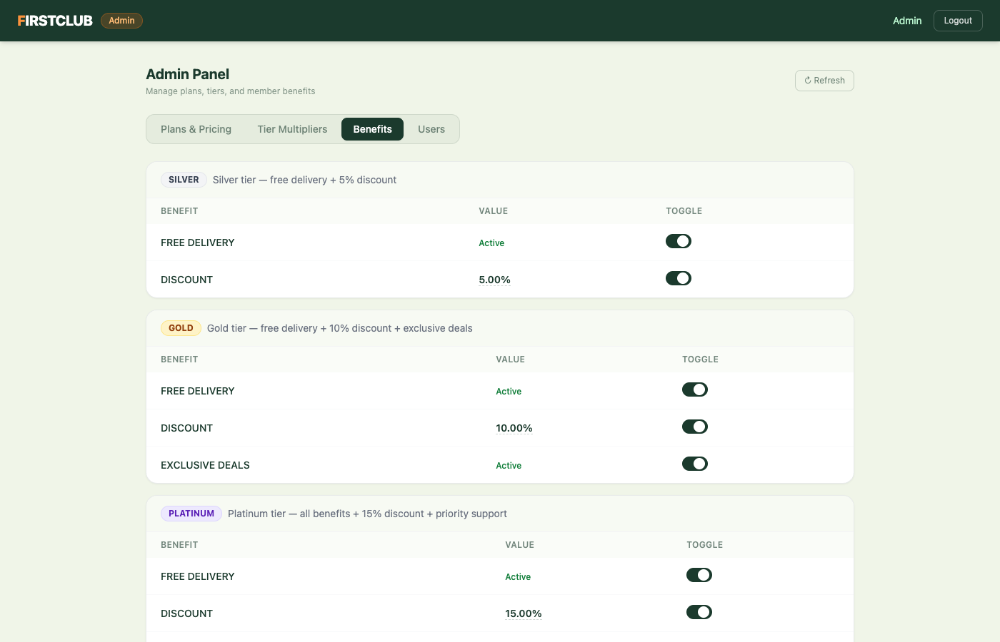
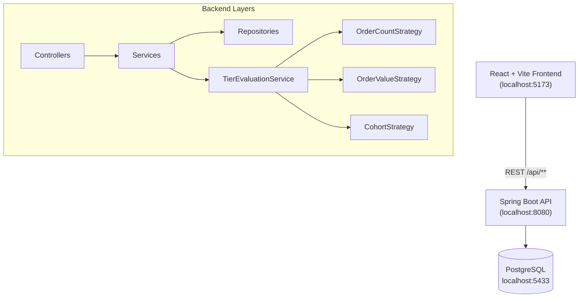

# FirstClub Membership System


A full-stack membership management system for FirstClub — a grocery platform. Members subscribe to **Monthly / Quarterly / Yearly** plans across **Silver / Gold / Platinum** tiers with DB-driven configurable benefits. Admins can edit prices, tier multipliers, and benefits live without redeployment.

---

## Screenshots

### Login Portal


### Member Dashboard — Tier & Plan Selection


### Admin Panel — Plans & Pricing


### Admin Panel — Tier Multipliers


### Admin Panel — Benefits Management


---

## Features

**Member side**
- Browse and select from 3 tiers (Silver / Gold / Platinum) and 3 billing plans (Monthly / Quarterly / Yearly)
- Tier-dependent pricing: effective price = base plan price × tier multiplier
- Live price preview before subscribing
- Upgrade or downgrade tier on an active subscription
- Cancel subscription

**Admin side**
- Edit base plan prices inline (click to edit)
- Edit tier price multipliers — effective price matrix updates live
- Toggle benefits on/off per tier; edit discount percentages
- View all registered members

**Backend design**
- Strategy Pattern for tier evaluation (order count, order value, cohort)
- Optimistic locking (`@Version`) on tier changes → HTTP 409 on conflict
- Pessimistic lock + `SERIALIZABLE` isolation on subscribe → prevents duplicate active subscriptions
- DB-driven benefits — configurable without redeploy

---

## Architecture



---

## Tech Stack

| Layer | Technology |
|---|---|
| Backend | Spring Boot 3.2.5, Spring Data JPA, Spring Validation |
| Database | PostgreSQL 15 (Docker) |
| ORM | Hibernate / JPA with optimistic + pessimistic locking |
| Frontend | React 18, Vite 5, Tailwind CSS 3, React Router v6 |
| Build | Maven 3.9 |
| Container | Docker Compose |

---

## Project Structure

```
first-club-assignment/
├── src/main/java/com/firstclub/membership/
│   ├── config/          # CORS, DataInitializer (seed data)
│   ├── controller/      # REST controllers
│   ├── dto/             # Request / Response records
│   │   ├── request/
│   │   └── response/
│   ├── exception/       # GlobalExceptionHandler, custom exceptions
│   ├── model/           # JPA entities
│   ├── repository/      # Spring Data repositories
│   └── service/
│       ├── tier/        # Strategy pattern — TierEvaluationStrategy
│       ├── AdminService.java
│       ├── MembershipPlanService.java
│       ├── MembershipTierService.java
│       ├── UserService.java
│       └── UserSubscriptionService.java
├── src/main/resources/
│   └── application.properties
├── frontend/
│   └── src/
│       ├── api/         # client.js — all fetch calls
│       ├── context/     # AuthContext (localStorage session)
│       ├── pages/       # LoginPage, UserDashboard, AdminPanel
│       └── components/  # Navbar
├── docker-compose.yml
└── pom.xml
```

---

## Getting Started

### Prerequisites
- Java 21+
- Maven 3.9+
- Docker Desktop
- Node.js 18+

### 1. Start the database

```bash
docker compose up -d
```

### 2. Start the backend

```bash
mvn spring-boot:run
# API available at http://localhost:8080
```

> On first run, Hibernate creates all tables and seeds demo data automatically (`ddl-auto=create-drop`).

### 3. Start the frontend

```bash
cd frontend
npm install
npm run dev
# UI available at http://localhost:5173
```

---

## Demo Credentials

| Role | Email | Password |
|---|---|---|
| Member | `alice@example.com` | *(no password — email only)* |
| Member | `bob@example.com` | *(no password — email only)* |
| Member | `carol@example.com` | *(no password — email only)* |
| Admin | `admin@firstclub.com` | `admin` |

---

## API Endpoints

### Plans
| Method | Endpoint | Description |
|---|---|---|
| `GET` | `/api/plans` | List all plans |
| `PUT` | `/api/admin/plans/{id}` | Update plan price / description |

### Tiers
| Method | Endpoint | Description |
|---|---|---|
| `GET` | `/api/tiers` | List all tiers with benefits |
| `PUT` | `/api/admin/tiers/{id}` | Update tier price multiplier |
| `PUT` | `/api/admin/benefits/{id}` | Toggle benefit / update discount |

### Users
| Method | Endpoint | Description |
|---|---|---|
| `POST` | `/api/users` | Create user |
| `GET` | `/api/admin/users` | List all users |

### Subscriptions
| Method | Endpoint | Description |
|---|---|---|
| `POST` | `/api/subscriptions` | Subscribe to a plan + tier |
| `GET` | `/api/subscriptions/users/{userId}` | Get active subscription |
| `GET` | `/api/subscriptions/users/{userId}/history` | Subscription history |
| `PUT` | `/api/subscriptions/{id}/tier` | Change tier (upgrade/downgrade) |
| `DELETE` | `/api/subscriptions/{id}` | Cancel subscription |

---

## Concurrency Design

Two-layer approach to handle concurrent requests safely:

1. **Subscribe** — uses `SELECT ... FOR UPDATE` (pessimistic lock) + `SERIALIZABLE` transaction isolation to prevent two simultaneous requests creating duplicate active subscriptions for the same user.

2. **Tier change** — uses `@Version` (optimistic locking) on `UserSubscription`. If two requests try to change the tier simultaneously, one succeeds and the other receives HTTP `409 Conflict`.

---

## Pricing Model

```
Effective Price = Base Plan Price × Tier Multiplier

Example:
  YEARLY (₹799) × PLATINUM (1.70×) = ₹1358.30
  YEARLY (₹799) × GOLD    (1.35×) = ₹1078.65
  YEARLY (₹799) × SILVER  (1.00×) = ₹799.00
```

Multipliers are stored in the database and editable live from the Admin Panel.
